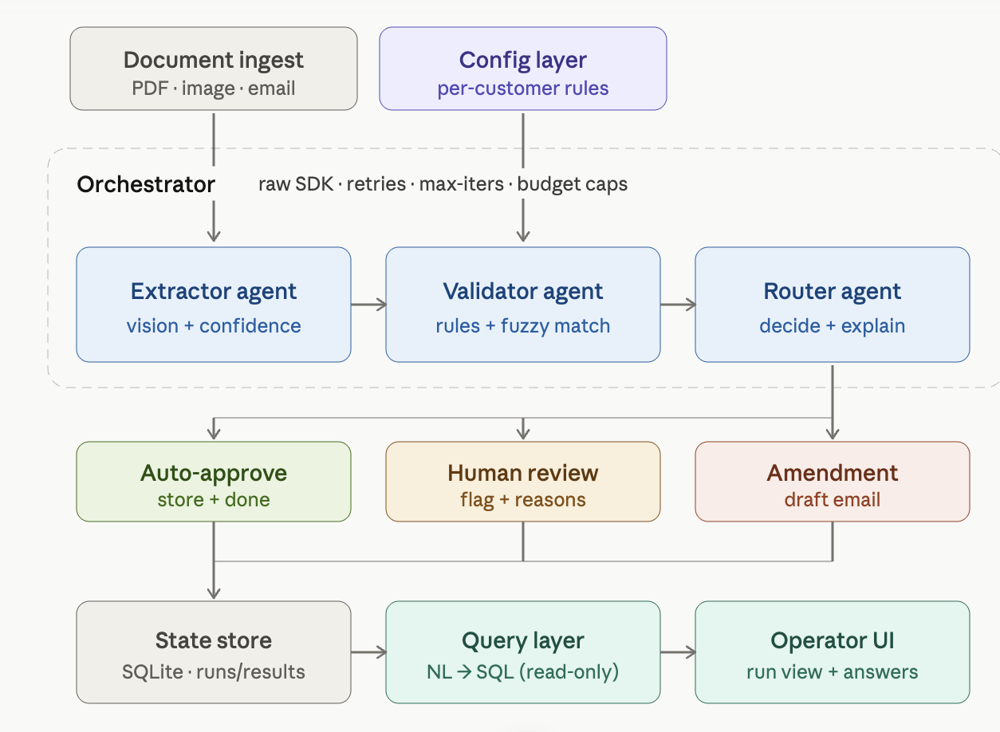
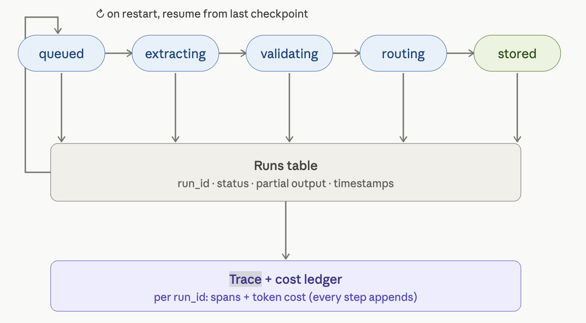

# Technical Write-up - Nova Trade-Doc Pipeline

## 1. Architecture

Two views, because "where data flows" and "where state lives / how we trace and
recover" are different questions.

**Data plane:**

Key decisions baked in: the **config layer is the Nova move** (generic engine,
per-customer rules); the **orchestrator is a controller, not an agent** (it owns
retries/budget/checkpoints - the agents only reason); the **router fans into three
outcomes that all merge into one store**, and the UI/query layer read the persisted
record, never the live pipeline - that separation is what makes runs traceable.

**Control plane:**

A run is a row whose
`status` advances `queued → extracting → validating → routing → stored`. Each step
appends a span (duration) + token cost to the `ledger`, keyed by `run_id`. The same
`run_id` is both the checkpoint key (crash recovery) and the trace key
(observability) - one mechanism, two jobs.

## 2. The three nastiest failure modes (from my own testing)

1. **The model silently "corrects" an ambiguous value - and reports it as a quote.**
   *This is the most important finding and it surfaced live.* On
   `messy_bill_of_lading.jpg` the HS code is printed `8471.3O` (letter O) on a
   rotated, blurred page. gpt-4o read it as `8471.30` **and returned `source_quote:
   "HS Code: 8471.30"`** - i.e. the "verbatim" quote was itself normalized, and it
   reported 0.95 confidence. So a `source_quote` is *evidence, not proof*: the model
   can fabricate a value and a matching quote together. *Implication for the design:*
   the grounding contract cannot be the sole guard. The actual backstops that held
   are the **deterministic rules** (the document still routed to `amendment` because
   the `DDP` incoterm violated the FOB/CIF allowlist regardless of the HS code) and
   the policy that any doubt escalates. *True fix (future work):* verify the quote is
   a substring of an independent OCR pass / use bounding-box grounding. We document
   this honestly rather than claim the guard is airtight.

2. **A number in the wrong unit can falsely pass.** `12,500 lb` (~5,670 kg) against a
   rule expecting `12,500 kg` is a ~2× error that an extract-the-number comparator
   waves through - a silent wrong approval, the worst failure class. *Defense
   (added):* `numeric_tolerance` now parses *(value, unit)*, normalizes unit aliases
   (`kgs`→`kg`), and treats a wrong unit as a **mismatch** and a *missing* unit as
   **uncertain** - never a pass. *Verified:* `12,500 lb` → `mismatch (unit)`;
   `12500` (no unit) → `uncertain`; `12,400 kgs` → `match`.

3. **Inconclusive semantic check defaulting to "mismatch."** Semantic equality
   ("Acme Imports Limited" vs "Acme Imports Ltd.") is deferred to a batched LLM call.
   If that call returns malformed/incomplete JSON, defaulting `match=false` would fire
   an *unjustified amendment*. *Defense (hardened):* a missing/malformed verdict now
   escalates the field to **uncertain → human review**, not a false mismatch.
   *Verified live:* the legitimate variant correctly resolves via the semantic path;
   the failure branch escalates rather than fabricating a discrepancy.

## 3. Observability - tracing one shipment across 50 customers

Everything is keyed by `run_id`. To trace a shipment end-to-end:
`SELECT * FROM ledger WHERE run_id = ?` returns every step with model, token
counts, USD cost, latency, and a detail note (including retries and errors). The
`runs` row carries the full extracted/validation/decision JSON and the status
trail. **Dashboard** (aggregates over these two tables): documents/hour, %
auto-cleared, false-auto-approve and human-override rates, median field confidence,
**cost per document**, and **p95 latency by step**. Per-customer slices fall out of
the `customer` column. An alert on rising human-override rate is the early signal
that extraction or a rule set has drifted.

## 4. Cost - back-of-envelope per document

| Step | Model | ~Tokens | ~Cost |
|---|---|---|---|
| Extract | gpt-4o (vision) | ~1.5k in (1 page hi-detail) + 0.3k out | **~$0.007** |
| Validate (semantic) | gpt-4o-mini | ~0.5k in + 0.1k out, *only if fuzzy fields* | ~$0.0001 |
| Route (reason+draft) | gpt-4o-mini | ~0.5k in + 0.3k out | ~$0.0003 |
| **Total** | | | **~$0.007-0.008 / doc** |

**Where it blows up:** vision tokens dominate (~90% of cost), and they scale with
page count and image detail. A 10-page packing list at high detail is the worst
case. **Controls already in place:** `MAX_PAGES=4` cap on ingest; validation/routing
on the ~30× cheaper mini model; a hard per-document budget cap that aborts runaway
runs. **Next levers:** prompt-cache the (static) system prompt + schema; only send
high-detail tiles for low-confidence fields on a second pass.

## 5. Latency - slowest hop

The vision extraction call is the slowest hop by far (multi-second; the text calls
are sub-second). Fixes, in order: (a) **parallelize multi-page** extraction instead
of sequential; (b) **prompt caching** to cut input processing; (c) stream partial
fields to the UI so perceived latency drops; (d) escalate to a slower/stronger model
*only* on low-confidence fields rather than the whole document. Validation and
routing are already cheap and could be merged into one model round-trip if needed,
but keeping them separate preserves the auditable deterministic boundary.

## 6. What I'd do differently with a week instead of a day

- **Expand the eval harness.** A trust-invariant suite is already in place
  (`backend/tests/`, 13 tests asserting the never-silently-approve guarantees and
  graceful degradation). Next: a labelled set of 30-50 real docs with gold fields +
  outcomes, gating changes on false-auto-approve rate - make trust a regression test,
  not a vibe.
- **Independent quote verification** - given the live finding that the model can
  normalize a value and report it as a verbatim quote, verify each `source_quote`
  against a separate OCR pass / bounding boxes, so grounding becomes proof, not just
  evidence. This is the highest-value reliability upgrade.
- **Confidence-calibrated escalation** - a measured second-pass policy rather than a
  single extraction attempt (current self-reported confidence clusters at ~0.95 and
  is not trustworthy on its own).
- **Wire the real exception loop** (supplier email round-trip with state tracking) -
  the highest-value extension and the bridge into Part 2.
- **Harden NL→SQL** with a query allowlist / parameterization beyond the current
  read-only keyword guard.
